# Blender でキーボードケースのレンダーを作る

これを、  
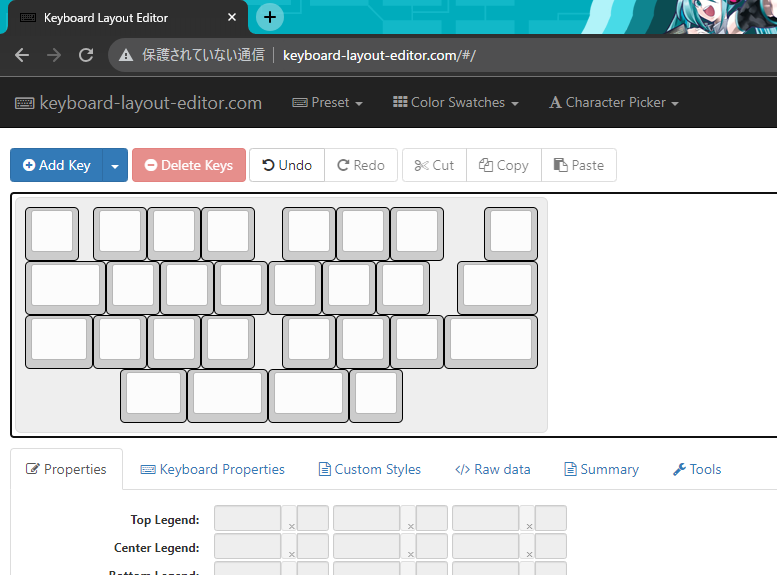  
こうします。  

## 目次

星が一つついている項目(★)はキーキャップ関連です。  
星が二つ付いている項目(★★)は基板関連です。  
必要ない場合は飛ばしてかまいません。  
特に、★ を行った場合 ★★ はほぼ見えません。  
見えないところにこだわる~~異常者~~方だけが参照していただければよいかなと思ってます。

- ★ キーボードを作る
  - ★ Keyboard Layout Editor でキー配置を作る
  - ★★ KiCAD で基板データを作る
  - ケースを作る
- Blender 用に出力する
  - ケースの出力
  - ★ キー配置の出力
  - ★★ 基板の出力
- Blender の設定
  - 単位関連の設定
  - レンダリング関連の設定
  - ★ キー配置インポート用の設定
- ケースを配置する
  - インポート
  - 座標設定
  - ★ 面をきれいにする
- マテリアルをいじる
  - アルマイト
  - ヘアライン
  - スモークアクリル
- レンダリング
  - 足場
  - ライティング
  - カメラ
  - レンダリング
- ★ キーキャップを配置する
  - keyboard-layout.json の読み込み
  - サイズ設定
  - 配置
- ★★ 基板を配置する
  - 基板データの読み込み
  - データクリーンアップ
  - 配置

## キーボードを作る

レンダーに使うキーボードの各種データを作成していきます。すでに存在する場合は飛ばしてよいです。

### ★ Keyboard Layout Editor でキー配置を作る

記事冒頭で提示したように、キーボードの配置を考えていきます。  

こちらのサイトで、自分の使いたいキー配置を作成します。  
[Keyboard Layout Editor](http://keyboard-layout-editor.com)  
刻印や色、(一部ですが)プロファイルも反映されるので、こだわる場合は設定しておくとよいです。

詳しい使い方はあちこちのサイトに紹介されているので触れません。

### ★★ KiCAD で基板データを作る

上記の配置を達成する基板データを作成します。  
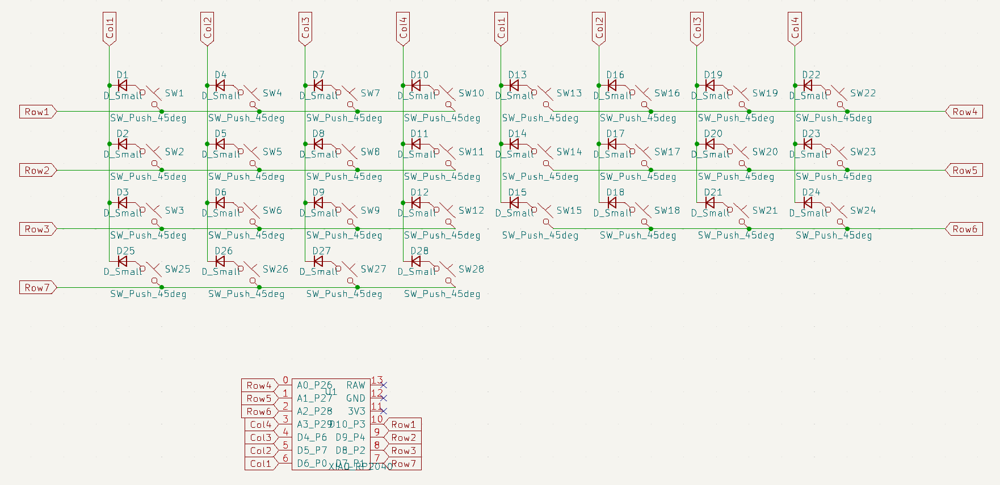  
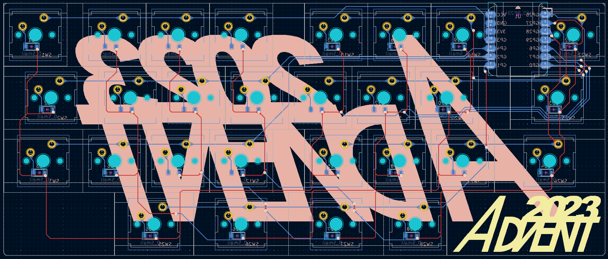

こちらも詳細は省きます。サリチル酸さんの本を買ってください。 (ダイマ)
https://booth.pm/ja/items/4410329

### ケースを作る

上記のキーボードを収めるケースを作成します。  
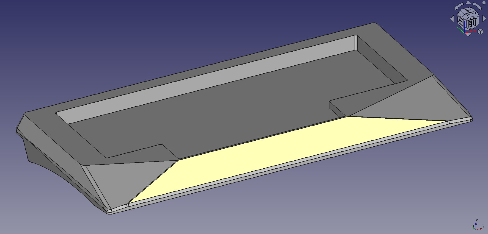

特に制約はないですが、自分のデータでは以下のように基板を収める部分(の、bounding box)が原点に対して上下・左右対称になるよう作成しています。  
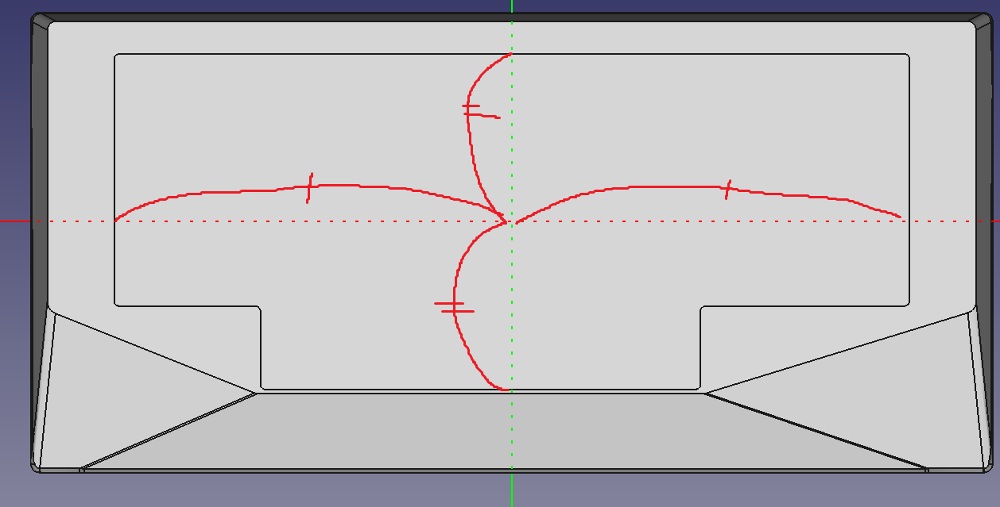  
また図にはありませんが、PCB が水平な状態で入る向き(伝わる？)で作るのもおすすめです。  
後々位置合わせが楽になるので意識してみるとよいと思います。

参考文献としてサリチル酸さんの本を買ってください。(ダイマ)  
https://salicylic-acid3.booth.pm/items/4982088

## Blender 用に出力する

作成した各種データを、Blender で読み込める形式で出力します。

### ケースの出力

以下は FreeCAD の場合です。他の CAD を使う方はいい感じに読み替えてください。

パーツを選択した状態で、`ファイル` > `エクスポート`を選択します。  
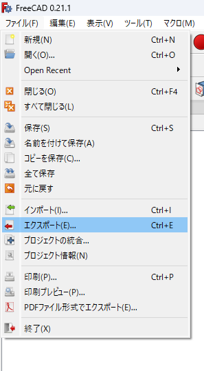

Blender で読み込める形式ならどれを選んでもよいですが、ここでは`Wavefront OBJ`形式を選択しています。  
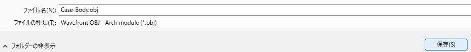

Blender で(デフォルトで)読み込める形式は、Blender を開き`File` > `Import`から確認できます。  
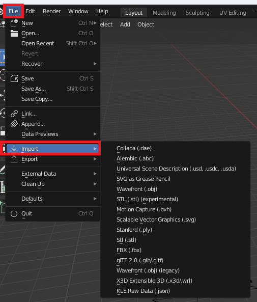  
形式によって扱いずらいデータが出てくる場合もあるので、個人的には OBJ で済ませるのが良いかなと思っています。

### ★ キー配置の出力

KLE にて、以下どちらかの方法で keyboard-layout.json をダウンロードできます(どっちも同じです)。  
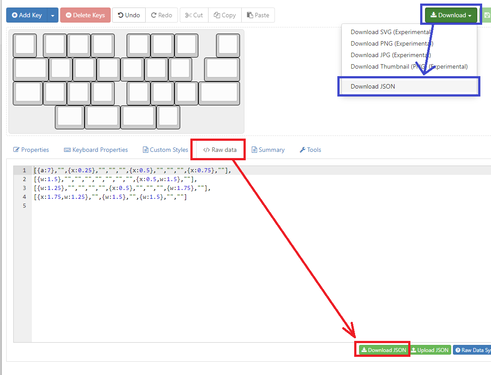

### ★★ 基板の出力

以下は KiCAD の場合です。他の EDA を使う方はいい感じに読み替えてください。

`ファイル` > `エクスポート` > `VRML...`を選択します。  
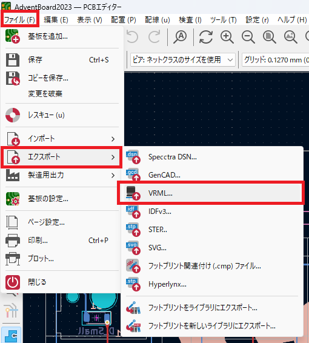  
VRML を使っている理由としては、

- Blender で直接インポートできる
- 色付き

の二点です。あとでわかる通りめちゃくちゃめんどくさいデータ構造なので、ほかにいいものあれば教えてください。

## Blender の設定

やや個人の好みが入っていますがこの設定しとくとやりやすいよってやつです。

### 単位関連の設定

図の三か所を変更します。  
  
左から順に、

- 単位系のデフォルトを`mm`に
  - キーボードのスケールに合わせる
- カメラのクリッピング距離を変更
  - デフォルトだとちょっと近づくとすぐに見えなくなる
  - 実際の値はよしなに
- グリッドを`mm`単位に
  - デフォルトだと広すぎて扱いづらい(好み)
  - 実際の値はよしなに

### レンダリング関連の設定

好みです。ただし、以下の解説では Cycles を前提にしたマテリアル設定が出てくるため、Eevee では見た目が大きく異なる/使用できない場合があります。  
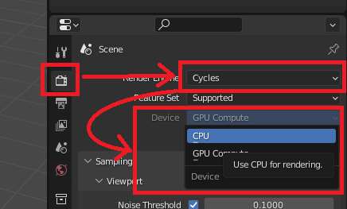

- `Render Engine`を`Cycles`に
- `Device`を設定
  - Cycles にしない場合は出てこない
  - GPU があるなら GPU Compute に
  - ないなら CPU のままでよいがクソ重い
    - 比較材料として、今回のレンダリング画像の出力には CPU で 3 時間、GPU で 5 分ほどかかりました。

### ★ キー配置インポート用の設定

以下のサイトから Blender のアドオンをダウンロードします。  
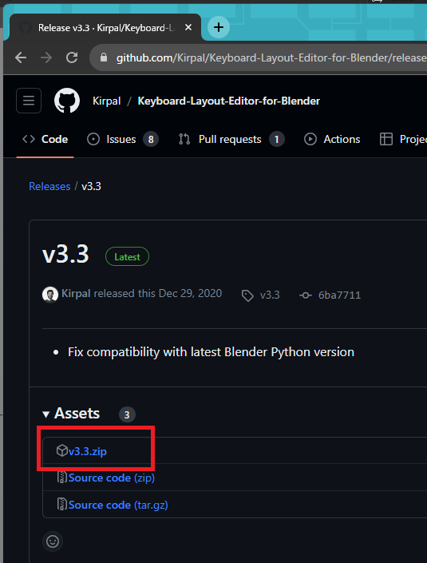  
https://github.com/Kirpal/Keyboard-Layout-Editor-for-Blender/releases/tag/v3.3

ダウンロードした zip を Blender で読み込みます。  
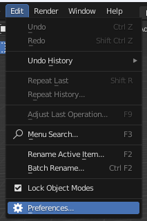  
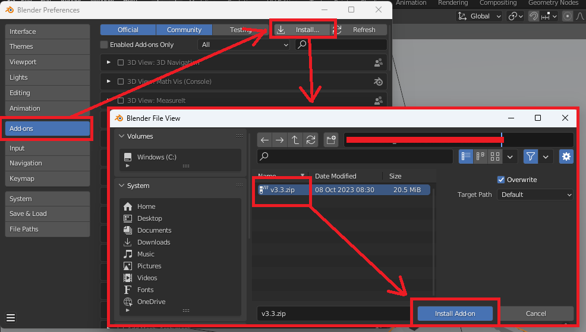

インストールしたアドオンを有効化します。  
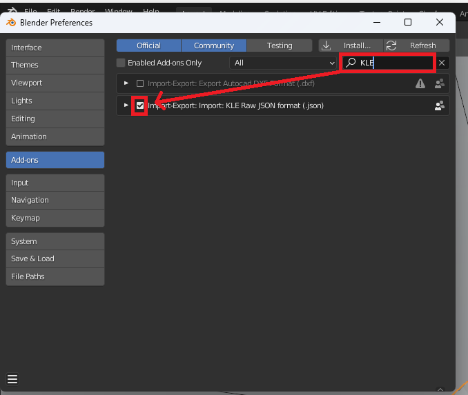

## ケースを配置する

ケースデータを読み込み、シーンに配置していきます。

### インポート

`File` > `Import` > `Wavefront(.obj)`を選択します。  
obj 以外で出力した場合は適切に読み替えてください。  

### 座標設定

出力時の設定にもよりますが馬鹿デカいものが出てくると思います。  
その場合はいい感じにサイズを縮小してください。  
画像の場合、`s.001` > `右クリックorEnter`で 1/1000 にすると実際のスケールになります。
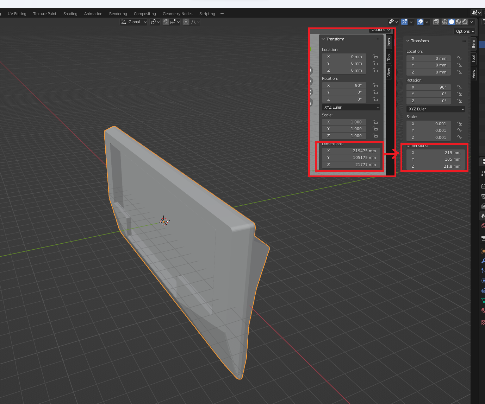

原点や向きが扱いづらいのでいい感じにしていきます。  
順に、

- `gz88.888`(数値は CAD 中の原点からケース最下部までの距離)
- `gy88.888`(同様にケース底面までの距離)
- `rx88.888`(同様にケース底面が水平になる角度)

で修正しました。  
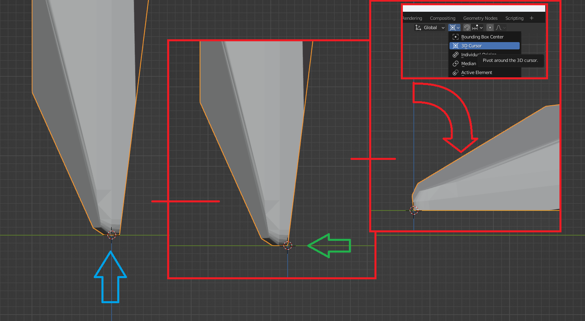

### 面をきれいにする

好みです＆とても面倒です。気にならない方はぜひ飛ばしてください。  
個人的にはかなり見た目に影響すると思っているので、できるだけ設定しています。

CAD から読み込んだ OBJ データは下図のように曲面がカクカクに描画されていることがほとんどです。  
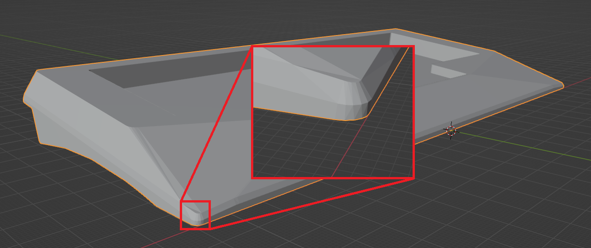  
これを、以下のように滑らかにします。  
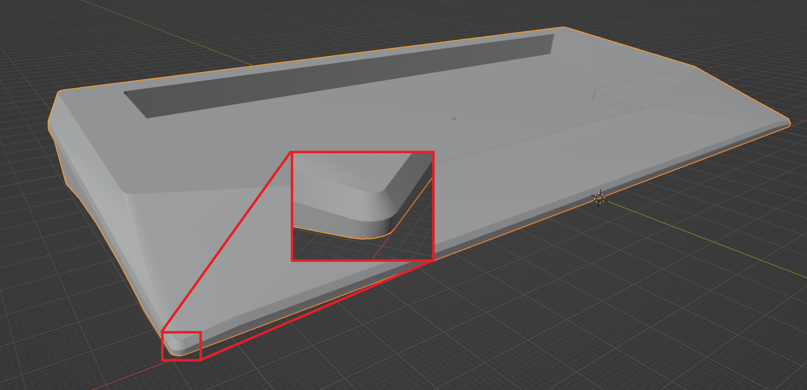

#### デフォルト設定でいい感じになるか試す

「滑らかな曲面」と「角ばった辺」で、大きく角度が異なる場合はこの設定のみで事足ります。  
オブジェクトを選択した状態で、`Object` > `Shade Auto Smooth` を選択します。  
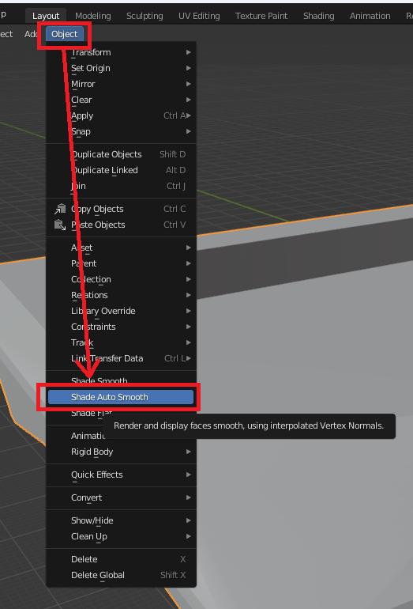

「滑らかな曲面」と判定される角度を調節することで、きれいに曲面とエッジが分かれてくれる場合はこれで終了です。  
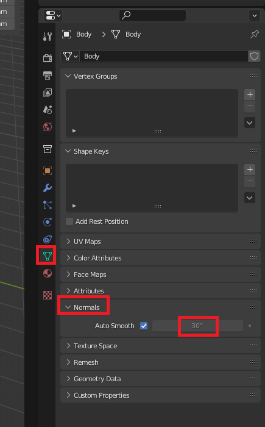

#### いい感じにならない場合

今回の自分のケースのように、角度の浅い面のつながりがある場合、Auto Smooth だけでは対応しきれません。  
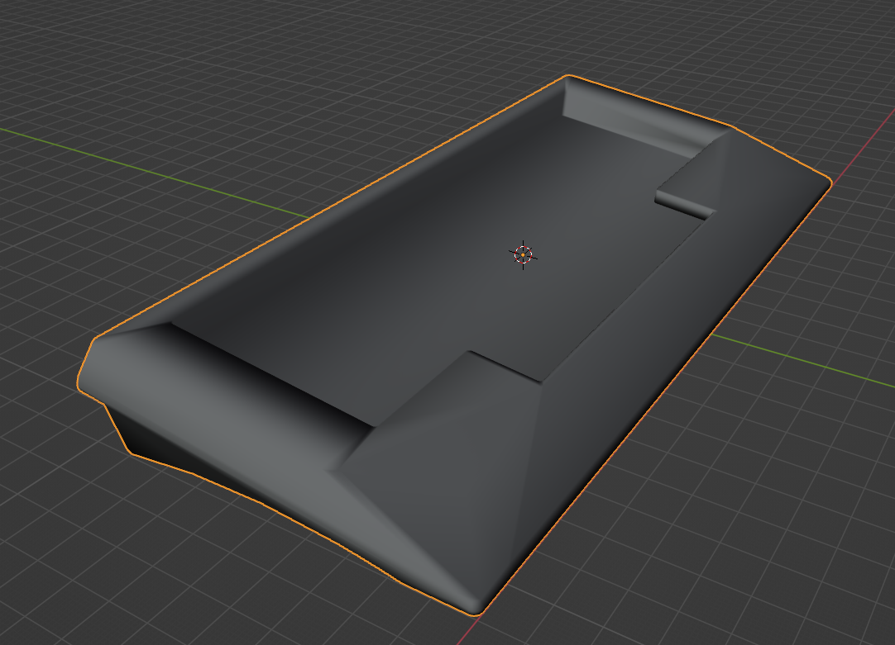

その場合は、「角度が浅いが角の出る辺」をそのようにマークしてあげることで、いい感じになります。

平らな面の一つを選択し、`Select` > `Select Linked` > `Linked Flat Faces`を選択します。  
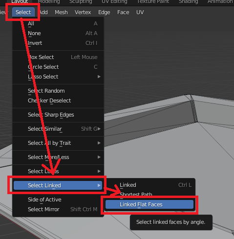  
この時画面左下にメニューが出ていますので、調整します。小さく設定することで浅い角度の面でも切り分けてくれるようになりますが、フィレットのような浅い角度でつながっている曲面もぶつ切りになるようになります。  
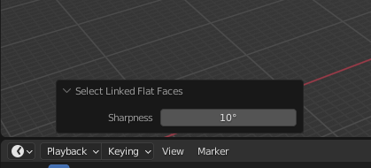  
滑らかにつながっていてほしい面はできるだけつながっていて、つながっていてほしくない＝エッジがはっきり出てほしい面は一つもつながっていない状態にします。(後者は後から分けるのが面倒です。前者を妥協して後から直すほうが楽)  
`Select` > `Select Loops` > `Select Boundary Loop`を選択することで、選択された面の外周の辺だけを選択できます。  
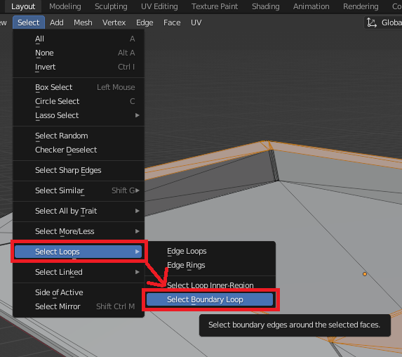  
この状態で、`Ctrl+E` > `Mark Sharp`を選択することで辺を「角の出る辺」としてマークすることができます。  
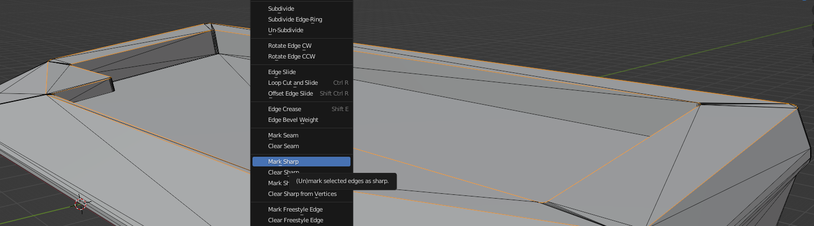

この操作を繰り返すことで、いい感じにエッジが出るように設定できます。  
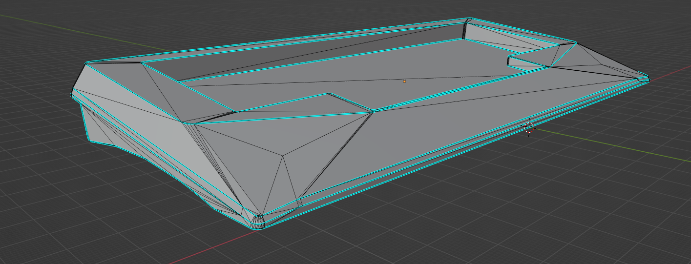  

## マテリアルをいじる

せっかくレンダリングするのでマテリアルをいい感じにしましょう。  
細かい設定だったり一般論だったりは他のサイトに任せますので、よく使ってるマテリアル設定を貼ります。  
※前述したとおり Cycles 前提のマテリアルです。あと適当なのでそんなにそれっぽくなかったりクソ重かったりします。

### アルマイト

  

### ヘアライン

### スモークアクリル

![Material_smoked_acrylic]

## レンダリング

レンダリングに向けて準備をし、実際にレンダリングしていきます。

### 足場

適当です。  
`Add` > `Mesh` > `Cube`を追加し、`s` > `Shift+z` > `2000`で 2m 四方の大きさにしたものを位置調節しました。  
  
マテリアルも適当です。なんか木っぽい感じにしようとしました。  

### ライティング

`Add` > `Light` > `Area Light`からライトを追加します。他のでもいいです。  
三点照明法っぽい感じにしようとしてます。毎度むずいです。誰か助けてくれ  
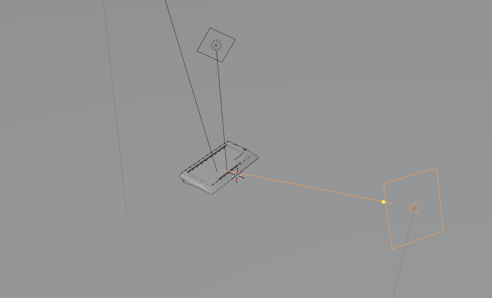  
見切れてますが上のほうに一個ライトがあります。

### カメラ

`Add` > `Camera`からカメラを追加します。なんかいい感じに見えるように配置します。誰か助けてくれ  
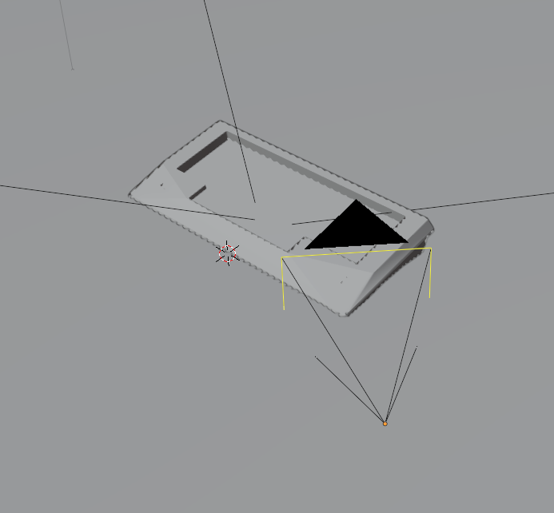

### レンダリング

`Image` > `Render Image`を押すとレンダリングが始まります。GPU がない人は耐えましょう。  

一旦完成です。  
ここから先はこだわる人向けです。

## ★ キーキャップを配置する

キーボードなのでキーキャップぐらいほしいですよね。  
安心してください、簡単にできますよ。

### keyboard-layout.json の読み込み

最初のほうでダウンロードした json ファイルを Import します。

`File` > `Import` > `KLE Raw Data(.json)`があるので、こちらを選択します。  
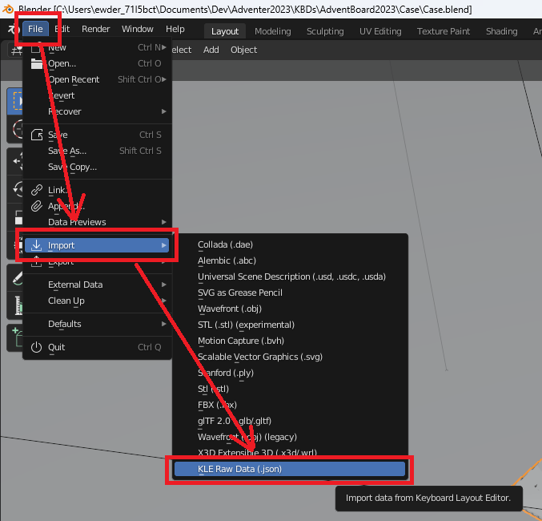

ダウンロードした json ファイルを開きます。  
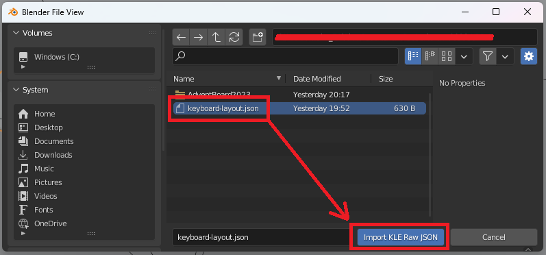

ちょっと時間がかかりますがインポートが始まります。

### サイズ設定

いつも通りでかいのでサイズ調整します。  
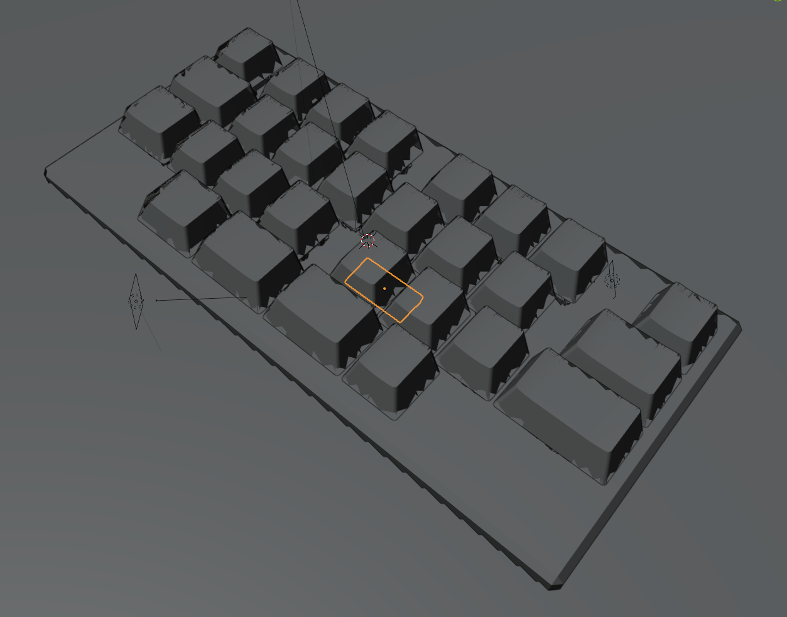

選択が外れてしまっている場合、Keyboard というコレクションが追加されているので`右クリック` > `Select Objects`ですべてのパーツを選択できます。  
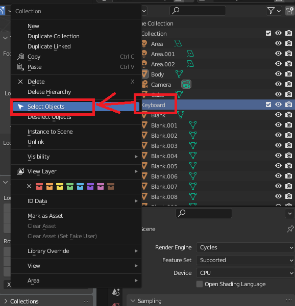

今回は`s.1`で 1/10 にしました。  
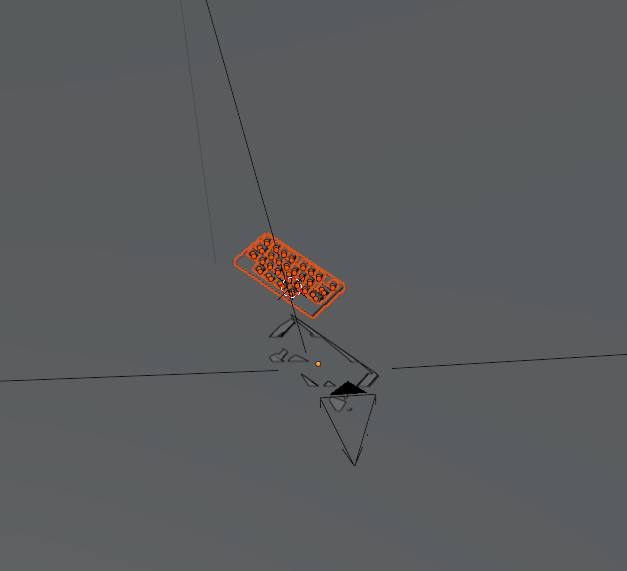

雑なケースがついてきますがいらないので消します。  
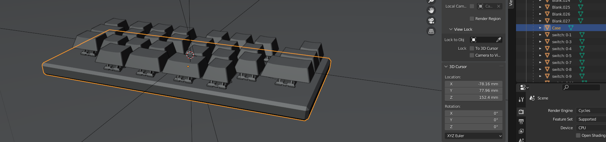

スイッチもついてます。なぜかちょっと小さいのでそのまま使うのはお勧めしません。  
使う場合はすべて選択したのち、pivot を Individual Origin にしたうえで、`s1.27`とすると実寸大に近くなります。  
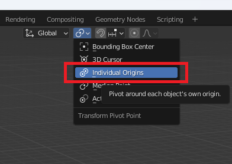  
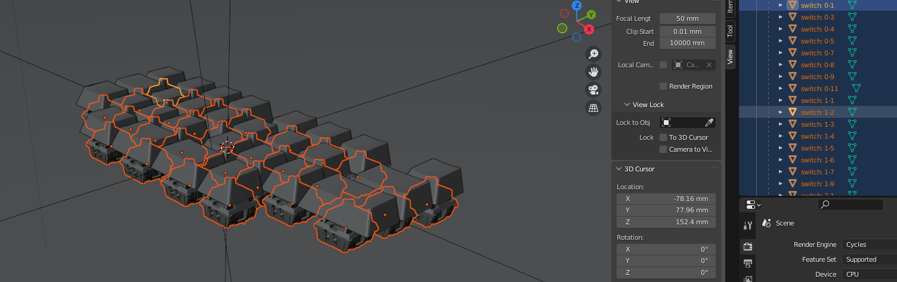  
私は後述の設定をしているので基本消してます。

さすがに時間がかかるので今回はやりませんでしたが、普段はさらに、キーキャップのポリゴン数を減らすクリーンアップ作業をしています。

### 配置

配置を楽にするため、すべてのオブジェクトを一つのオブジェクトの子にします。

`Add` > `Empty` > `Plain Axis`から空オブジェクトを作成します。  
  
変なことをしてなければキーキャップ外形の中心に十字架の中心がいるはずです。ずれていたらインポートからやり直したほうが早いです。

キャップ(スイッチを残している人はスイッチも)をすべて選択した後、先ほどの empty を追加選択します(十字架が薄いオレンジ、ほかが濃いオレンジになると思います。色変えてる人は知りません)。  
`Ctrl+p` > `Object`で親子関係を作成します。  
  
親子関係を作ったので、empty を移動させたり回転させればキャップがまとめて移動したり回転したりします。

empty をいい感じにケースの床に移動させます。(ずれてないように見えててもやっといたほうが無難です)  
ケースを選択した状態で、`Object` > `Snap` > `Cursor to Selected`を選択します。カーソル(赤白の点線の丸と黒いひげのやつ)がケース原点に移動します。

Empty を選択した状態で、`Object` > `Snap` > `Selection to Cursor`を選択します。empty 原点がカーソル＝ケース原点に移動します。
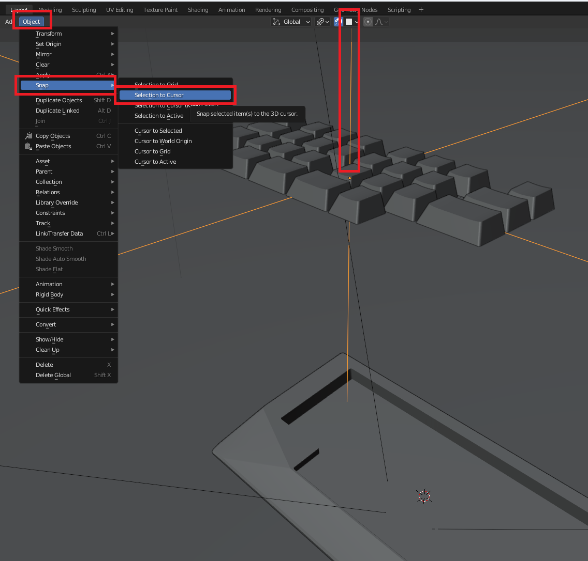  
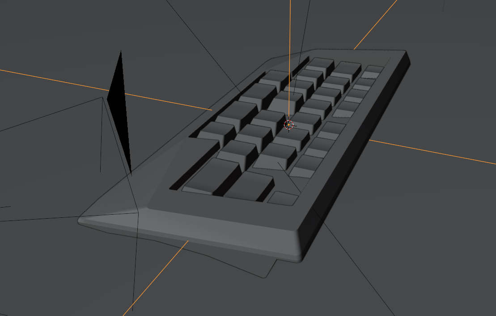

あとは、向きや高さを合わせます。先に向きを合わせ(`rx7`：グローバルの x 軸で回転)、その後高さを合わせる(`gzz12`：ローカルの z 軸で移動)と楽です。  
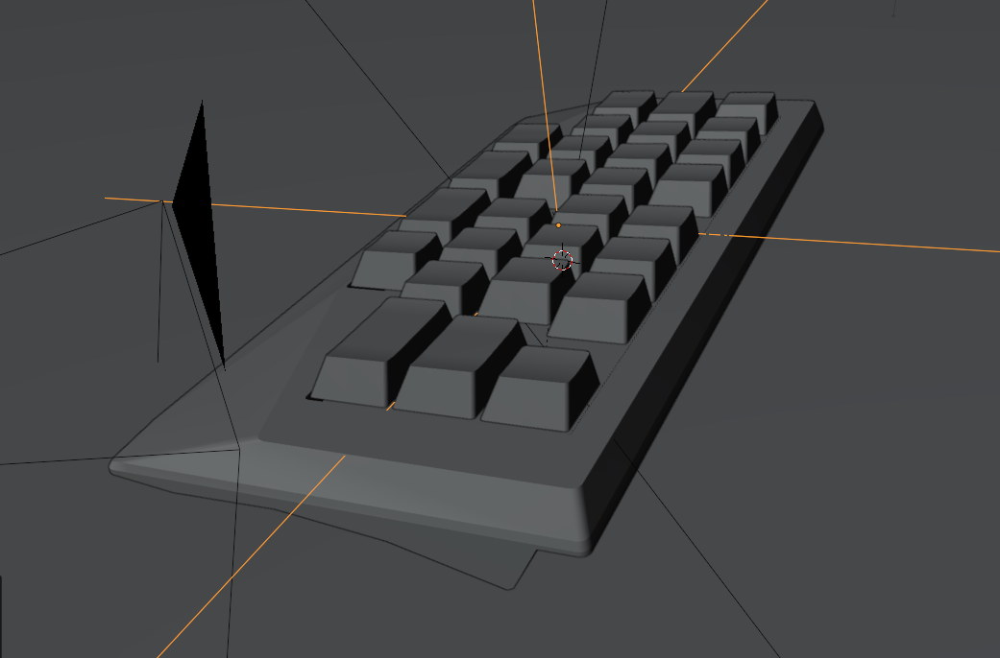

これで完成です。

ここから先は見えないところに時間をかけてこだわる~~狂人~~僕みたいな人向けの内容になります。

## ★★ 基板を配置する

基板のデータを読み込み、キーキャップの下に仕込みます。  
プレート等も同様の手順で作成できるので応用してみてください(svg あるならそっちのほうが楽です)。

### 基板データの読み込み

先にコレクションを作り、選択しておくと楽です。(キーキャップの項で説明した Select Objects がほぼ必須)  
`File`>`Import`>`X3D Extensible 3D(.x3d/.wrl)`から KiCAD が吐いた wrl ファイルを読み込みます。  
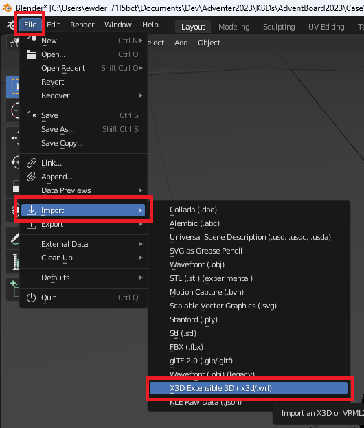  
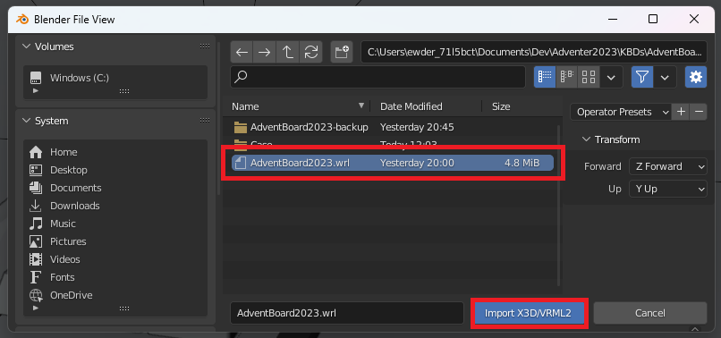

### データクリーンアップ

毎度のことながらクソでかいので縮めます。 ... の前に、まずはデータをまとめます。  
Hierarcy を見るとわかる通り非常にオブジェクトが多いです。何かというと、キースイッチの各面がなぜかバラバラに出てきています。(SHAPE_1 ～ SHAPE_160 くらいまでがキースイッチのポリゴン)  
そのままでは扱えたものではないので、一つのオブジェクトにまとめてしまいます。

hierarchy を一番下までスクロールし(この時選択解除しないように気を付けてください)、下から何個目かにある、マテリアルが緑色のオブジェクトを`Ctrl+Click`で選択してください。  
基板の面面か裏面で、原点が基板中央になっています(なっていなかったら、そうなっている別のオブジェクトを使ってください)。  

`Ctrl+j`で一つのオブジェクトにまとめ、その後 pivot を Cursor にした状態で縮小(`s.001`)します。
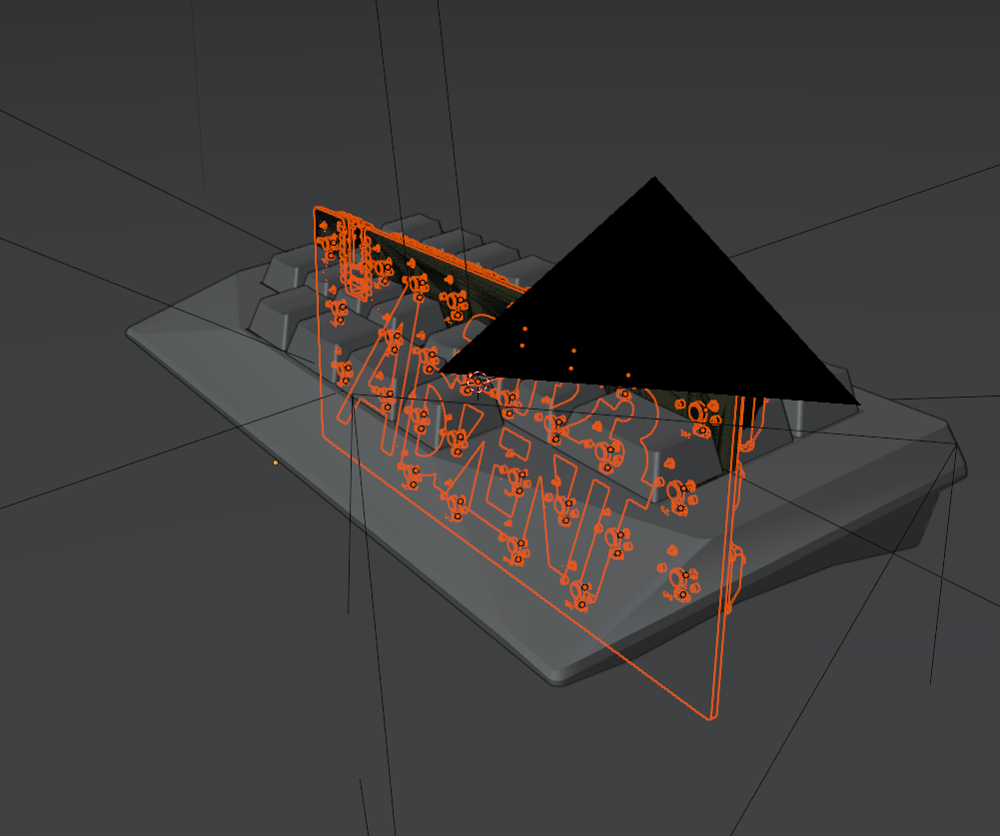

まとめただけで面がばらばらだとライティング時に不都合なので、くっつけられる場所はくっつけていきます。  
編集モードに入り、選択を全解除します。その後、以下の手順をすべてのマテリアルに対して繰り返します。  
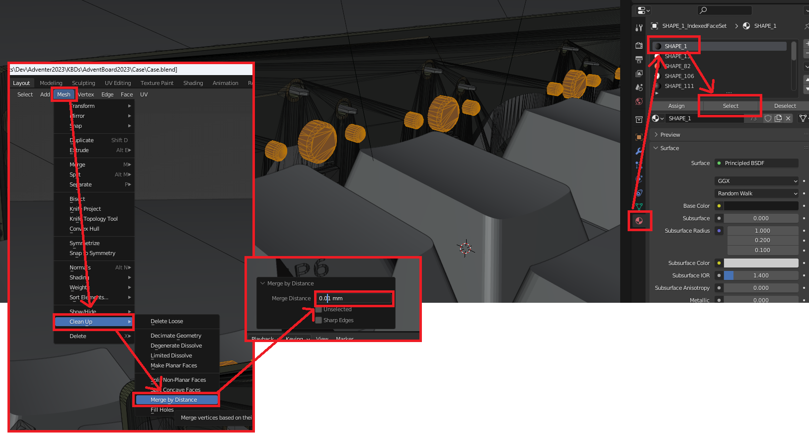

- マテリアルを一つ選択し、`Select`で対応する面を選択します。
- `Mesh` > `Clean Up`(u キー) >`Merge by distance`(b キー)を選択します。
- (初回のみ)Merge Distance を 0.01mm とかそこらにします(細かい部品がつぶれるのを防ぐため。よしなに)。
- 何もないところをクリックし、選択解除します。

すべてのマテリアルについてマージしたらクリーンアップ完了です。

キーキャップ同様今回はスキップしましたが、普段は各部品の Smooth 設定をやってます。バカじゃないの？

### 配置

オブジェクトモードに戻り、キーキャップの時と同様`Object`>`snap`を活用して原点に位置合わせします。  
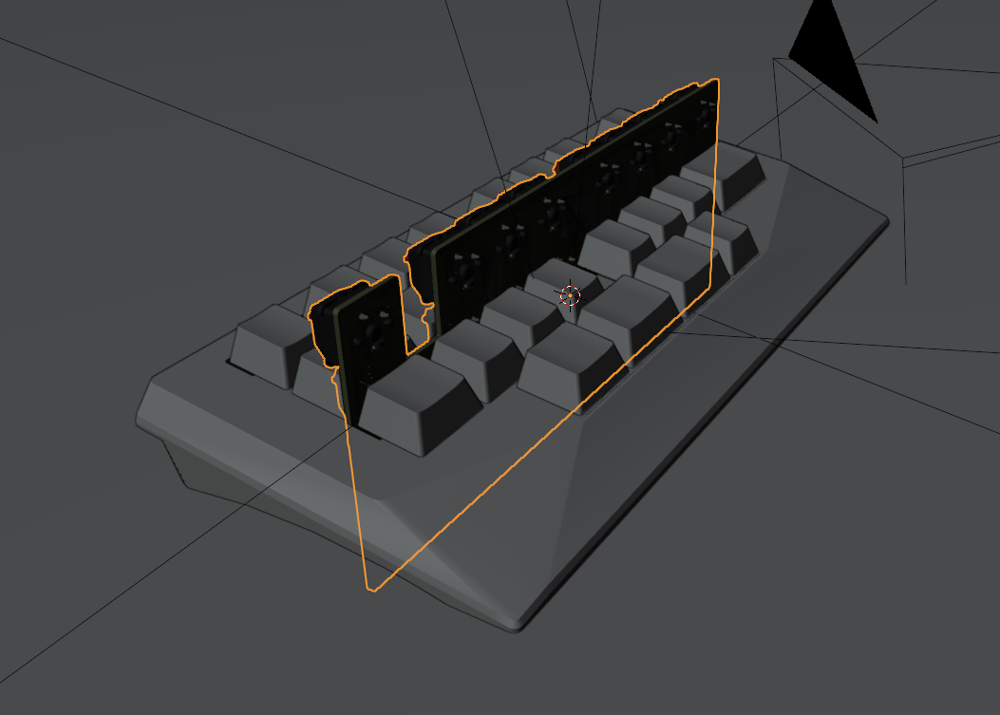

回転、座標合わせをして完成です。  
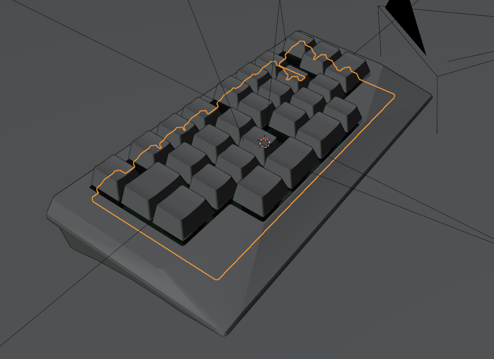

最終的なレンダリング結果はこちら。  

